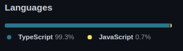

<h1 align="center">🍔🍔 Aplicativo Bogiatto Hamburgueria 🍔🍔</h1>

<!--ts-->
   * [Demonstração](#Demonstracao)
   * [Sobre](#Sobre)
   * [Status do Projeto](#Status-do-Projeto)
   * [Tecnologias](#tecnologias)
   * [Desenvolvedores](#Desenvolvedores)
   * [Configurações](#configuracoes)
<!--te-->
---
<br/>


### Demonstracao:

<br><br>||
<br>

### SOBRE:
<br/>

📑 **Project Description** 

<p align="justify">Este repositório é destinado ao registro e documentação do aplicativo mobile desenvolvido pela  <a href="http://aldeiaconsultoriajr.com/">Aldeia Consultoria Jr.</a> para a empresa Bogiatto Hamburgueria. Como o código é de patente única e esclusiva do acordo entre às empresas, ele não vai ser disponibilizado neste repositório.</p>

---
<br/>


### Status do Projeto
<br/>

💻 **Finalizado** 

Resta apenas o upload do mesmo na Google Play

---
<br/>


### Tecnologias

<br/>

🖊 **As seguintes ferramentas e linguagens foram usadas na construção do projeto:** 

- React Native
- Expo
- PostgreeSql
- Adonis
- DBeaver
- Insomnia
- Docker
- TypeScript
- ...

🖊 **Dependencias utilizadas no projeto:** 

<h6>(package.json)</h6>

```javascript
"dependencies": {
    "@expo-google-fonts/jost": "^0.2.0",
    "@expo/vector-icons": "^12.0.0",
    "@react-native-async-storage/async-storage": "^1.15.9",
    "@react-native-clipboard/clipboard": "^1.9.0",
    "@react-navigation/native": "^6.0.4",
    "@react-navigation/native-stack": "^6.2.2",
    "async-storage": "^0.1.0",
    "axios": "^0.21.4",
    "expo": "~42.0.1",
    "expo-app-loading": "^1.1.2",
    "expo-barcode-scanner": "~10.2.2",
    "expo-clipboard": "~1.1.0",
    "expo-font": "~9.2.1",
    "expo-image-picker": "~10.2.2",
    "expo-permissions": "~12.1.1",
    "expo-status-bar": "~1.0.4",
    "react": "16.13.1",
    "react-dom": "16.13.1",
    "react-native": "https://github.com/expo/react-native/archive/sdk-42.0.0.tar.gz",
    "react-native-masked-text": "^1.13.0",
    "react-native-paper": "^4.9.2",
    "react-native-progress": "^5.0.0",
    "react-native-qrcode-svg": "^6.1.1",
    "react-native-safe-area-context": "3.2.0",
    "react-native-screens": "~3.4.0",
    "react-native-svg": "^12.1.1",
    "react-native-web": "~0.13.12"
  },
  "devDependencies": {
    "@babel/core": "^7.9.0",
    "@types/react": "~16.9.35",
    "@types/react-native": "~0.63.2",
    "typescript": "~4.0.0"
  },
```

<br><br>||
<br>
---
<br/>


### Desenvolvedores & Contribuidores


😍 **Contributions to main, excluding merge commits and bot accounts:** 

<br/>

|[ <br> <sub> Pablo Lucas </sub>](https://github.com/pablolucas890)|[ <br> <sub> Vinicius Charleaux </sub>](https://github.com/ViniciusCharleaux)|[ <br> <sub> Gabriel Azevedo </sub>](https://github.com/azevgabriel)|[ <br> <sub> Leonardo Henrique </sub>](https://github.com/LeoHPC)|[ <br> <sub> Caroline Melo </sub>](https://github.com/CarolineFMelo)|[ <br> <sub> vinícius Ferraz </sub>](https://github.com/thevinex)|[ <br> <sub> Leandro Augusto </sub>](https://github.com/leandroaugust0)|
| :---: | :---: | :---: | :---: | :---: | :---: | :---: |

---
### Configuracoes


**Configurações Importantes a Respeito do App:** 

<br/>

-   Desenvolvimento:
    -   Instalar o node, npm e yarn
    -   Rodar (yarn) para baixar os pacotes
    -   Rodar (expo start) para startar o aplicativo no localhost
    -   Baixar Expo Go e ler QrCode
-   BackEnd
    -   [Desenvolvido por Gabriel Azevedo](https://github.com/azevgabriel)
    -   Api - Adonis
    -   Banco de dados - PostgreeSql
    -   Hospedado na AWS Server com a conta particular do desenvolvedor
    -   [Repositório do BackEnd](https://github.com/azevgabriel/api_APP_Hamburgueria)
-   Publicação
    -   Expo (Generate apk file)
        -   app.json
            -   package name (com.aldeia.bogiattocupons)
            -   name (Bogiatto Cupons)
            -   slug (BogiattoCupons)
        -   expo build:android
        -   Login Expo
            -   Email (projetosacj@gmail.com)
            -   User (aldeiajunior)
            -   Password (VTMRBpn8W.Tu@pg)
        -   Project ID
            -   881cd064-f89e-41fa-b533-dc4bdca4a6f4
        -   [Link](https://expo.dev/@aldeiajunior/BogiattoCupons)
-   Google Play (App Store)
-   Tutoriais e Documentação
    -   Publicação
        -   [Vídeo RocketSeat](https://www.youtube.com/watch?v=IJ-lv7TGC4k&ab_channel=CarlosLevir)
        -   [PDF CheckList RocketSeat](https://www.docdroid.net/3VZ5uCy/deploy-gps-pdf)
    -   Configurações de instalação e ambientes
        -   [CheckList RocketSeat](https://www.notion.so/Instala-o-das-ferramentas-d0ae754d04794235beecdd7331d480b5)